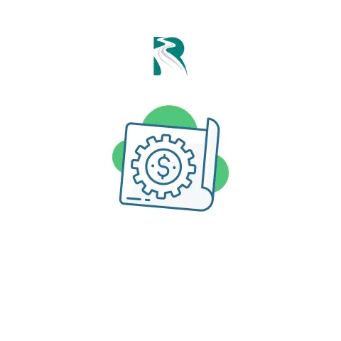

<h1 align = 'center'> 👋 Hi, I’m KINGDOM ADELE </h1>

A highly skilled and results-driven Software Engineer with over a decade of experience in full-stack web development, encompassing front-end technologies like HTML5, CSS3, JavaScript, jQuery, TypeScript and React.js, as well as back-end technologies such as Node.js, PHP, and Python. Proficient in utilizing various databases including MySQL, PostgreSQL, and MongoDB. Adept at developing scalable and maintainable applications (microservices architectural designs), with a strong focus on clean code practices and test-driven development (TDD) and Behavior-Driven Development (BDD). Experienced in defensive coding and software security measures. Familiar with Docker CLI, Kubernetes CLI (Kubectl), and DevOps principles. Excellent communication and teamwork abilities, with a proven track record of delivering high-quality solutions under tight deadlines.

- 👀 Also a gradguate of mechanical enginnering, RSU.
- 🌱 I’m currently majoring in fullstack web development and testing, DevOps/DevSecOps, database management and project management.
- 🏘 i am certified by IBM, ALX, META, GOOGLE, NIIT, MRsoft, ADMAS, ...
- 📫 reach me **+2348068578748 (izzylovu@gmail.com)...**

<h3 align = 'center'> 
  💞️ I’m looking to collaborate on any (web) development project involving HTML, CSS, JavaScript(ES6), Jquery, PHP(Laravel), Python(Django or Flask), Node(Express), MySQL, MongoDB, C, DevOps, Software testing(BDD and TDD), Cloud computing and loading..., 
  or in areas relating to database management and/or project management
  </h3>

<!---
IZZYLOVE/IZZYLOVE is a ✨ special ✨ repository because its `README.md` (this file) appears on your GitHub profile.
You can click the Preview link to take a look at your changes. 
--->

    
    
    

