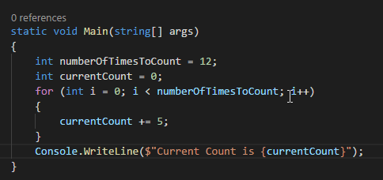

<h1 align = 'center'> 👋 Hi, I’m KINGDOM ADELE </h1>

- 🏘  I am a gradguate of mechanical enginnering, RSU.
- 👀 I’m interested in software engineering...
- 🌱 I’m currently learning fullstack web development at MRsoft, using django ...
- 🏘 i have done full stack web development, Admacs computers, using php
- 🌱 i am also running a software engineering course with ALX
- 📫 reach me **+2348068578748 (izzylovu@gmail.com)...**

<h3 align = 'center'> 
  💞️ I’m looking to collaborate on any (web) development project involving HTML, CSS, JavaScript, Jquery, PHP, MySQL, C, Python and loading...
  </h3>

<!---
IZZYLOVE/IZZYLOVE is a ✨ special ✨ repository because its `README.md` (this file) appears on your GitHub profile.
You can click the Preview link to take a look at your changes.
--->

